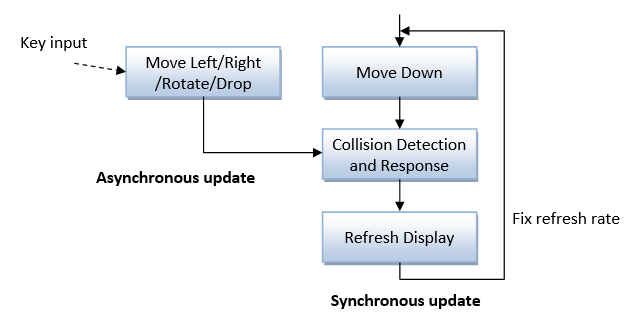
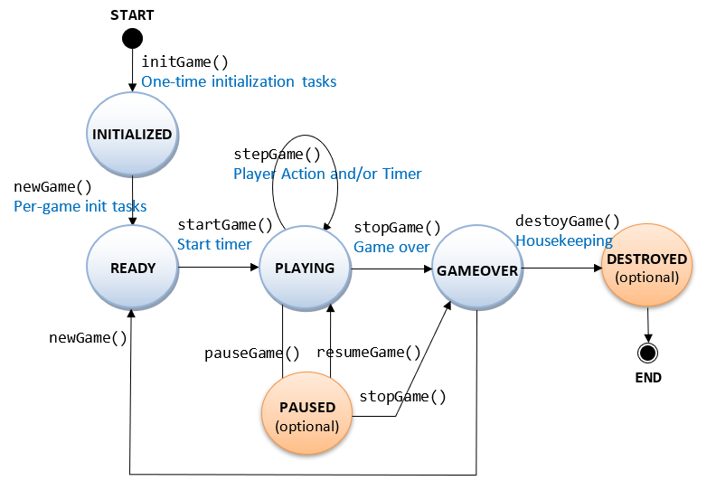
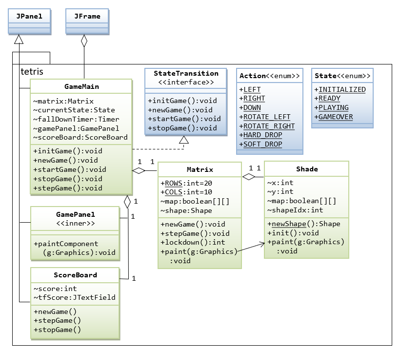
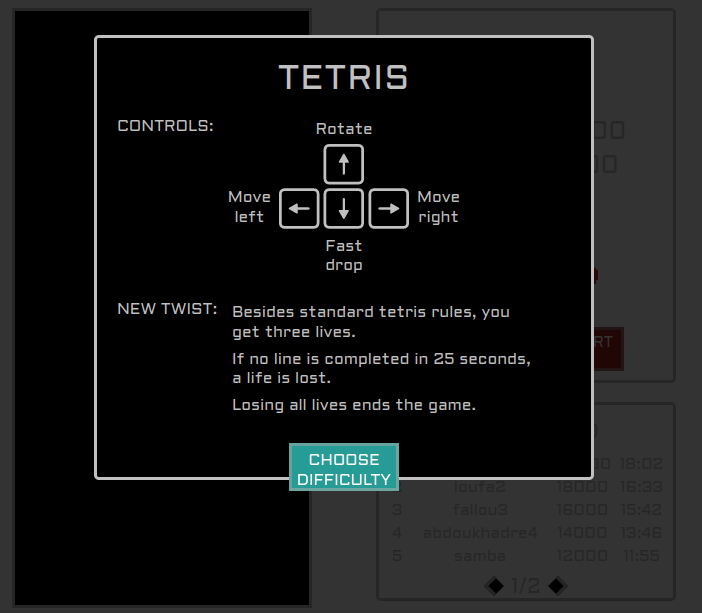
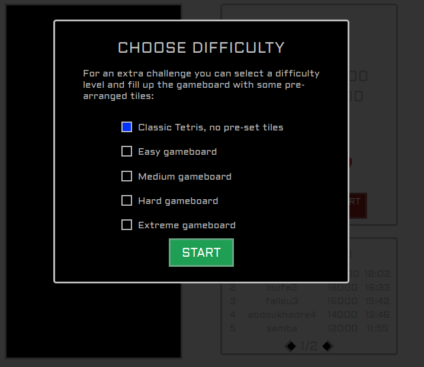
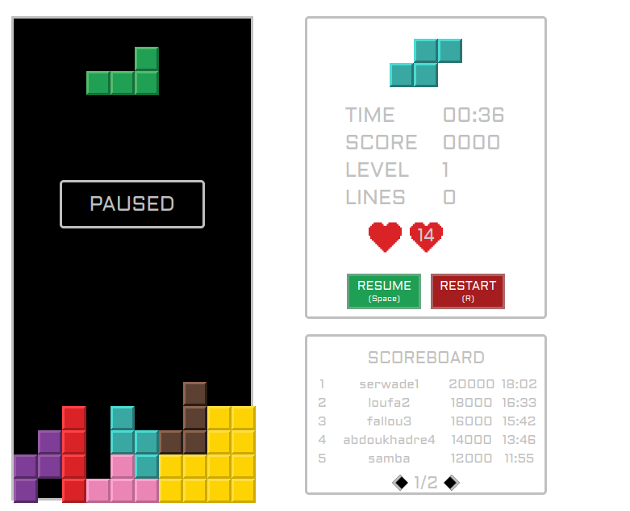
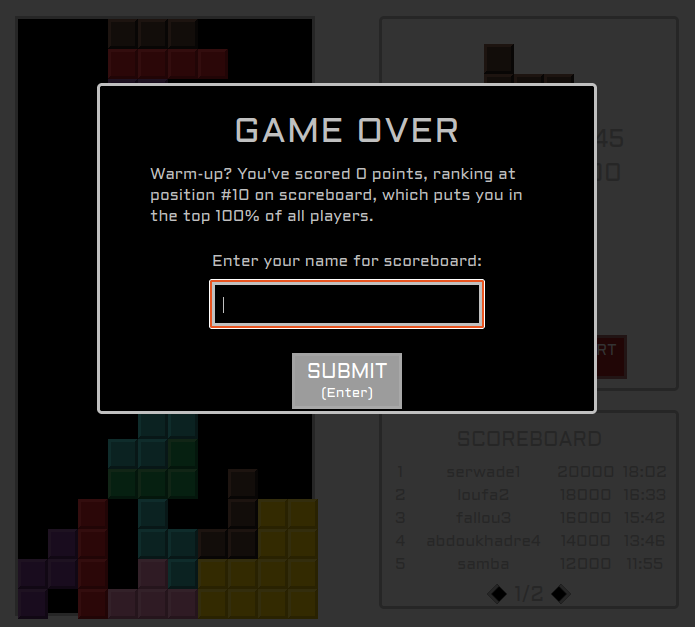

# Make your game - different-maps

The goal for this task was to create a game using only plain JavaScript and HTML
(usage of frameworks and canvas was not allowed) and also to generate tile maps at the start of the game.

# Authors

- Mouhamadoufadilou Diop - [mouhamadoufadiop](https://learn.zone01dakar.sn/git/mouhamadoufadiop)
- Abdou Khadre Wade - [serwade](https://learn.zone01dakar.sn/git/serwade)  

# Usage

This project uses the Gorilla WebSocket package for handling WebSocket connections.
Ensure you have this package installed before attempting to run the server.
For installation run the following command in your terminal:

`go get github.com/gorilla/websocket`

If you have the Gorilla Websocket installed run the Go server with:

`go run . `

# Rules

The goal of the game is to clear lines using falling
tetrominoes as in standard Tetris rules.
Every 10 lines cleared levels up the game, making tetrominoes fall
faster.  
As the task included also to implement lives system, the game starts with 3 lives.
If no line is completed in 25 seconds, players loses
one heart. Losing all hearts ends the game.
Before the game starts you will be prompted to choose the difficulty level of the game,
which determines how full the game board is with some pre-arranged tiles:

- Classic Tetris, no pre-set tiles
- Easy gameboard
- Medium gameboard
- Hard gameboard
- Extreme gameboard.
# Timing and Event Handling

 ## Below is the timing diagram:
  

 # State Diagram

This state diagram is partially implemented, having states INITIALIZED, PLAYING and GAMEOVER.
 

 # Implementation
# # Class Diagram
 

# Scoring

Player gets points by the amount of lines cleared at once and the current level:

| Completed lines |   Points    |
| :-------------: | :---------: |
|        1        | 100 x Level |
|        2        | 300 x Level |
|        3        | 500 x Level |
|        4        | 800 x Level |
# Screenshots

 
 
 
 
